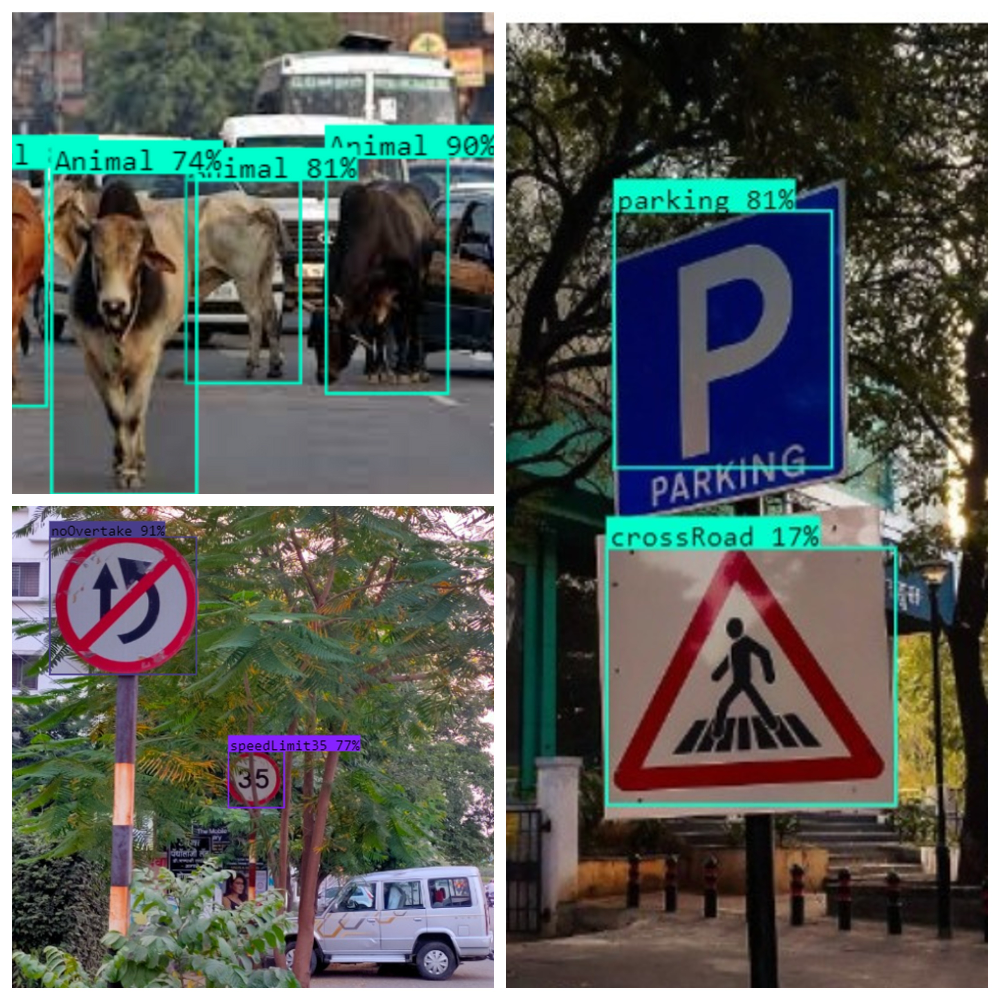

# TrafficSignRecognition using YOLOV5

In this project we have achieved the following:

<ul>
<li>Created custom Indian Traffic Sign and Signal Dataset with over 4100 images.</li>
<li>Worked with YOLO processing and model training on custom dataset.</li>
<li>Integrated model with frontend using Flask API with a basic frontend.</li>
<li>Generated instructions for the input frame after processing the image.</li>
<li>Video Processing integrated with the model.</li>
<li>Achieved an overall mean Average Precision (mAP) of the model is 80.7% after running on 180 epochs.</li>
</ul>

### Steps to clone the repository-

1. Fork the repository to your github.

2. Clone the forked repository to your system.

### Steps to run the code-

1. Open the terminal or command prompt in the root directory.

2. Install Dependencies

```
      pip install -r requirements.txt
```

3. Write the command-

```
      python main.py
```

### Sample images of the working of the system-

1. After running the main.py file-


2. It will ask the user to upload image-


3. Output-


4)Click on reset button to go back

### Some of the Results-


